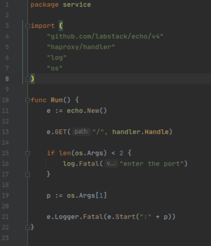
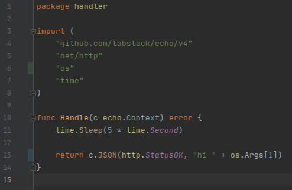
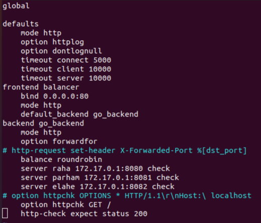

# haproxy
I have had a repository for learning and practicing 'nats' then I started thinking about what the difference is 
between different technologies for load balancing.The biggest difference is that technologies like 'nats' and 
'rabbitmq' are used to dispatch jobs inside a project to different workers but technologies like 'nginx' and 'haproxy' 
are used to dispatch incoming http requests to different servers.
In this repository I want to learn how to use 'haproxy' to balance http traffic.

## How to use haproxy
Using haproxy is super simple regardless of the language of backend here I have an easy code in golang and then added  
haproxy. 
My code creates an endpoint and with every get request it just sleeps 5 seconds and then says hi. 

  
then we need haproxy, I use docker-compose to run it  

// volume

//haproxy.cfg
